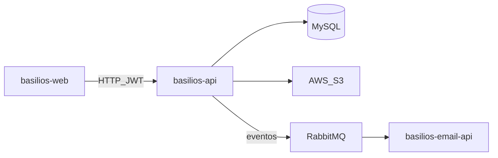

# Basilios API

API REST da plataforma **Basilios** — delivery de hamburgueria com pedidos online, painel operacional, autenticação JWT, promoções e integração com pagamentos/armazenamento.

## Stack

- Java 21 · Spring Boot 3.5
- Spring Security + JWT
- Spring Data JPA · MySQL
- RabbitMQ (eventos de pedido / reset de senha)
- AWS S3 (imagens)
- WebSocket · SpringDoc OpenAPI
- Rate limiting (Bucket4j)

## O que a API cobre

- Auth e usuários (roles cliente / funcionário)
- Produtos, adicionais e promoções
- Pedidos e status
- Horários da loja e dashboard
- Upload de arquivos (S3)
- Publicação de eventos para o microsserviço de e-mail

## Arquitetura (visão rápida)



Repositórios relacionados: [basilios-web](https://github.com/Basilios-SPTech/basilios-web) · [basilios-email-api](https://github.com/Basilios-SPTech/basilios-email-api) · [basilios-infra](https://github.com/Basilios-SPTech/basilios-infra)

## Como rodar localmente

Pré-requisitos: JDK 21, MySQL e RabbitMQ (ou use o [basilios-infra](https://github.com/Basilios-SPTech/basilios-infra) com Docker Compose).

```bash
cd basilios
./mvnw spring-boot:run
```

API padrão: `http://localhost:8080`


## Testes

```bash
cd basilios
./mvnw test
```

## Licença

MIT — veja [LICENSE](LICENSE).
